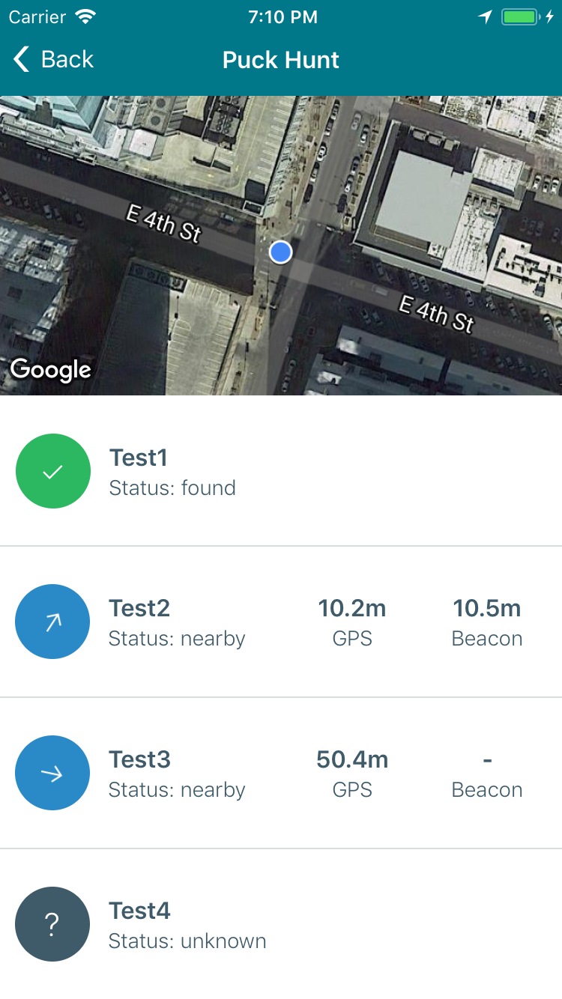

## Puck Hunt
My wife loved the idea of the [San Jose Sharks puck scavenger hunt](https://www.nhl.com/sharks/fans/see-the-puck), and I was looking for an excuse to try out React Native, so I built a little app where we could create our own scavenger hunt.

Here's what the app looks like when you're on the scavenger hunt


To setup the scavenger hunt I put [iBeacons](https://en.wikipedia.org/wiki/IBeacon) on the pucks before hiding them, and then I used the admin interface in the app to save the GPS coordinates of each puck.


(Admin) Hiding a puck | (Admin) Overview
----------------- | ---------------------
 | 

## API Server
The backend server used for storing puck locations is built with Node.js and uses PostgreSQL as the database

## Running the server locally

1. Running a local PostgreSQL w/ [docker-compose](https://docs.docker.com/compose/)
    1. __Prerequisites:__ You'll need to have [docker-compose](https://docs.docker.com/compose/) installed
    1. `cd` into the `server` directory
    1. Start the local PostgreSQL instance by running `docker-compose up`, and then wait for PostgreSQL to start
    1. __First time setup only:__ In a new shell, run the following command to setup the database schema and load some mock data

          ```bash
          docker cp db_setup.sql server_postgres_1:/home/db_setup.sql && docker exec -e PGPASSWORD=postgres server_postgres_1 psql -U postgres -f /home/db_setup.sql postgres
          ```
1. Running the API server locally
    1. __Prerequisites:__ You'll need to have [Node.js 7+](https://nodejs.org/en/) and [Yarn](https://yarnpkg.com/en/) installed
    1. `cd` into the `server` directory
    1. __First time setup only:__ Run `yarn` to install dependencies
    1. Run `yarn run app` to start the API server on `localhost:8080`

## Running the app in the simulator

1. __Prerequisites:__ You'll need to have [Node.js 7+](https://nodejs.org/en/), [Yarn](https://yarnpkg.com/en/) and [Xcode](https://developer.apple.com/xcode/) installed
1. `cd` into the `PuckHunt` directory
1. Run `yarn run app`

